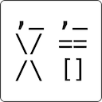
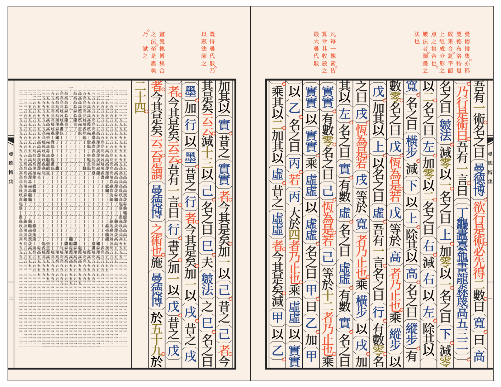
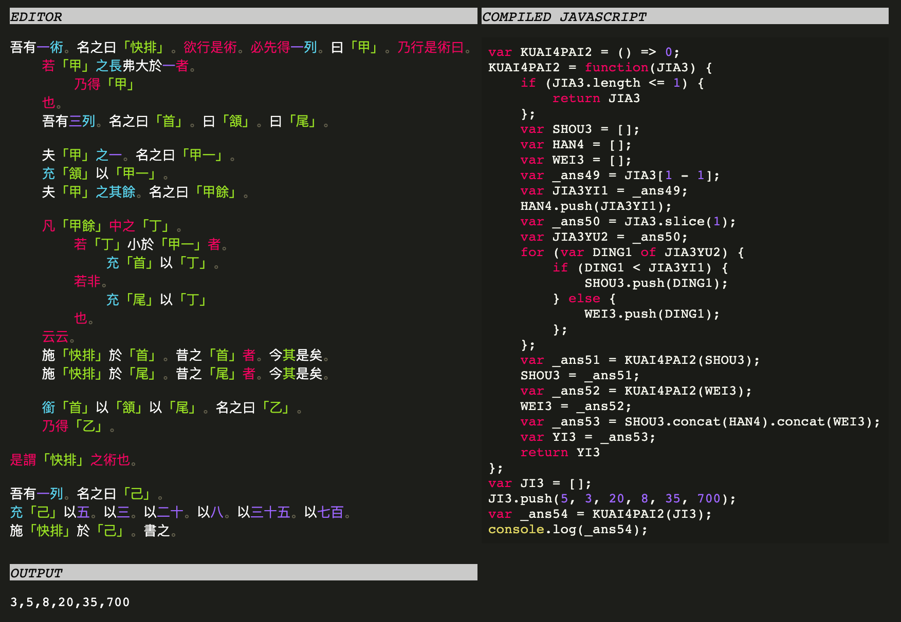
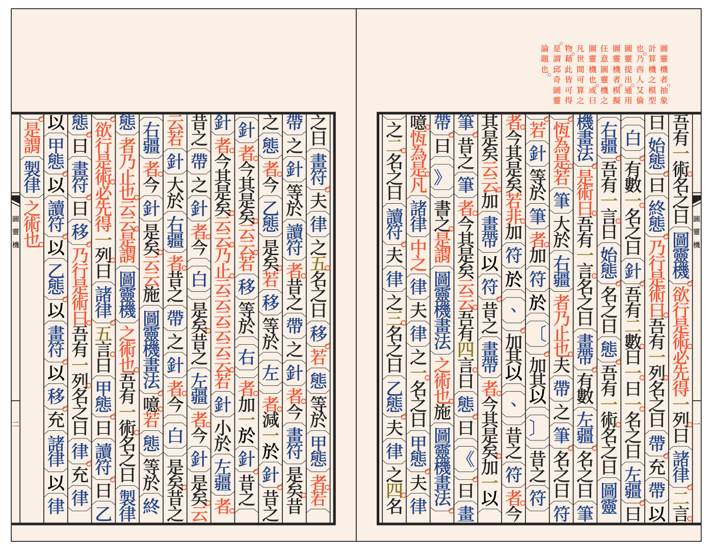

# 文言 wenyan-lang

[](https://www.npmjs.com/package/@wenyanlang/core)
[](https://github.com/LingDong-/wenyan-lang/actions)
[](https://app.netlify.com/sites/wenyan-lang/deploys)

### [https://wy-lang.org](https://wy-lang.org)

English | [简体中文](./README.zh-Hans.md) | [繁体中文](./README.zh-Hant.md)

文言文編程語言。A programming language for the ancient Chinese. [Try it online.](https://wy-lang.org/ide)



[**CHANGELOG**](./CHANGELOG.md)

## 序

> 夫[唐](https://en.wikipedia.org/wiki/Emperor_Yao)、[虞](https://en.wikipedia.org/wiki/Emperor_Shun)之世，[結繩而足治](https://ctext.org/book-of-changes/xi-ci-xia/zh)，屈指而足算。是時豈料百代之後，計算機械之巧，精於[公輸](https://en.wikipedia.org/wiki/Lu_Ban)之[木鳶](https://en.wikipedia.org/wiki/Lu_Ban#Inventions)，善於[武侯](https://en.wikipedia.org/wiki/Zhuge_Liang)之[流馬](https://en.wikipedia.org/wiki/Wooden_ox)；程式語言之多，繁若[《天官》](https://ctext.org/shiji/tian-guan-shu/zh)之星宿，奇勝[《山經》](https://en.wikipedia.org/wiki/Classic_of_Mountains_and_Seas)之走獸。[鼠](https://golang.org/)、[蟹](https://www.rust-lang.org/)、[鑽](http://ruby-lang.org/)、[魚](https://fishshell.com/)，或以速稱。[蛇](https://www.python.org/)、[象](https://www.php.net/)、[駱](https://www.perl.org/)、[犀](http://shop.oreilly.com/product/9780596805531.do)，各爭文采。方知[鬼之所以夜哭，天之所以雨粟](https://ctext.org/huainanzi/ben-jing-xun/zh)。然以文言編程者 ，似所未有。此誠非文脈之所以傳，文心之所以保。[嗟予小子](https://zh.wikisource.org/zh-hant/%E6%A6%AE%E6%9C%A8_(%E9%99%B6%E6%B7%B5%E6%98%8E))，遂有斯志。然則數寸之烏絲猶覆於頭，[萬卷之素書未破於手](https://zh.wikisource.org/zh-hant/%E5%A5%89%E8%B4%88%E9%9F%8B%E5%B7%A6%E4%B8%9E%E4%B8%88%E4%BA%8C%E5%8D%81%E4%BA%8C%E9%9F%BB)；一身長羈於遠邦，兩耳久曠于[雅言](https://zh.wikipedia.org/wiki/%E9%9B%85%E9%9F%B3)。然夫文章者吾之所宿好，程式者偶承時人之謬譽。故[希孟](https://en.wikipedia.org/wiki/Wang_Ximeng)不慚年少，[莊生](https://en.wikipedia.org/wiki/Zhuang_Zhou)不望[無涯](https://ctext.org/zhuangzi/nourishing-the-lord-of-life/zh)。乃作斯言。誠未能嘔瀝[長吉](https://en.wikipedia.org/wiki/Li_He)之[心血](https://zh.wikisource.org/zh-hant/%E6%9D%8E%E8%B3%80%E5%B0%8F%E5%82%B3)，亦庶幾免於[義山](https://en.wikipedia.org/wiki/Li_Shangyin)之[流沫](https://zh.wikisource.org/zh-hant/%E9%9F%93%E7%A2%91)。既成之後，復學[干將鑄劍](https://zh.wikisource.org/wiki/%E9%91%84%E5%8A%8D)而自飼，[越王嚐糞](https://ctext.org/wu-yue-chun-qiu/yue-wang-gou-jian-wu-nian/zh)而當先。自謂偶追[《十書》](https://en.wikipedia.org/wiki/Ten_Computational_Canons)之筆意，但恨少[八家](https://en.wikipedia.org/wiki/Eight_Masters_of_the_Tang_and_Song)之淋漓。此[子山](https://en.wikipedia.org/wiki/Yu_Xin)所謂[士衡撫掌而甘心，平子見陋而固宜](https://zh.wikisource.org/zh-hant/%E5%93%80%E6%B1%9F%E5%8D%97%E8%B3%A6)。然則雖實[覆甕](https://zh.wikisource.org/zh-hant/%E6%99%89%E6%9B%B8/%E5%8D%B7092#%E5%B7%A6%E6%80%9D)之質，尚存斧正之望；雖乏[呂相](https://en.wikipedia.org/wiki/L%C3%BC_Buwei)之金，[易字](https://zh.wikisource.org/zh/%E5%8F%B2%E8%A8%98/%E5%8D%B7085)之渴蓋同。此亦開源之大義，吾輩之所以勉勵也。一笑。


## Helloworld

Wenyan:

```
吾有一數。曰三。名之曰「甲」。
為是「甲」遍。
	吾有一言。曰「「問天地好在。」」。書之。
云云。
```
Equivalent JavaScript:

```JavaScript
var n = 3;
for (var i = 0; i < n; i++) {
	console.log("問天地好在。");
}
```

Output:

```
問天地好在。
問天地好在。
問天地好在。
```

Punctuations and newlines are completely optional (just like they are in Classical Chinese), so the above code is equivalent to:

```
吾有一數曰三名之曰「甲」為是「甲」遍吾有一言曰「「問天地好在」」書之云云
```

More sophisticated examples, such as the Sieve of Eratosthenes, Quicksort, Mandelbrot set, and Tower of Hanoi, can be found in the `./examples` folder.

## Features
- [Natural Language Programming](https://en.wikipedia.org/wiki/Natural-language_programming) sharing the grammar of [Classical Chinese](https://en.wikipedia.org/wiki/Classical_Chinese)
- Compiles to [JavaScript](https://developer.mozilla.org/en-US/docs/Web/JavaScript), [Python](https://python.org), or [Ruby](http://ruby-lang.org)
- [Turing complete](https://github.com/LingDong-/wenyan-lang/blob/master/examples/turing.wy)
- An [online IDE](https://wy-lang.org/ide)
- [Examples](https://github.com/LingDong-/wenyan-lang/tree/master/examples) to get started


## Installation

### The Compiler

Install the compiler by

```bash
npm install -g @wenyanlang/cli
```

Try run the included examples, e.g.:

```bash
wenyan examples/helloworld.wy
# will outputs: 問天地好在。
```

> From v0.1.0, the `wenyan` command will direct execute the script by default. If you are migrating from previous versions, please use `wenyan -h` to output the help and check [this PR](https://github.com/LingDong-/wenyan-lang/pull/356) for the detailed changes.


### [The Online IDE](https://wy-lang.org/ide)




### [The Decompiler](https://zxch3n.github.io/wenyanizer/)

You can now translate JavaScript to wenyan-lang using the [wenyanizer](https://github.com/zxch3n/wenyanizer) by [zxch3n](https://github.com/zxch3n).

### 3rd Party Compilers

- [JVM compiler](https://github.com/MagicLu550/wenyan-lang_jvm) by [MagicLu550](https://github.com/MagicLu550)

### Text Editor Plugins

- [Plugin for VSCode](https://github.com/antfu/wenyan-lang-vscode) by [antfu](https://github.com/antfu)
- [Plugin for Vim](https://github.com/voldikss/vim-wenyan) by [voldikss](https://github.com/voldikss)
- [Plugin for Sublime Text](https://github.com/absop/SublimeWenyan) by [absop](https://github.com/absop)

### Browser Runtime

You can now run Wenyan scripts right in your html file.

Please refer to [Browser Runtime](./documentation/Runtime.md)

### Advance Usage

[Compiler API Specification](./documentation/Compiler-API.md)

## Syntax Cheatsheet

You can find the Language Specification [here](https://wy-lang.org/spec) (WIP). To get started, you can also check the cheatsheet below, or look into `src/parser.js` to learn more. Be sure to check out the examples from the online IDE too!

### Variables

| wenyan | JavaScript |
|---|---|
|`吾有一數。曰三。名之曰「甲」。` | `var a = 3;` |
|`有數五十。名之曰「大衍」。` | `var dayan = 50;` |
|`昔之「甲」者。今「大衍」是矣。` | `a = dayan;` |
|`吾有一言。曰「「噫吁戲」」。名之曰「乙」。` | `var b = "alas!";` |
|`吾有一爻。曰陰。名之曰「丙」。` | `var c = false;` |
|`吾有一列。名之曰「丁」。` | `var d = [];` |
|`吾有三數。曰一。曰三。曰五。名之曰「甲」曰「乙」曰「丙」。` | `var a=1,b=3,c=5;` |
|`吾有一元` | `(auto type)` | 

### Control

| wenyan | JavaScript |
|---|---|
|`若三大於二者。乃得「「想當然耳」」也。` | `if (3>2){ return "of course"; }` |
|`若三不大於五者。乃得「「想當然耳」」。若非。乃得「「怪哉」」也。` | `if(3<=5){return "of course"}else{return "no way"}` |
|`為是百遍。⋯⋯ 云云。` | `for (var i = 0; i < 100; i++){ ... }` |
|`恆為是。⋯⋯ 云云。` | `while (true) { ... }` |
|`凡「天地」中之「人」。⋯⋯ 云云。` | `for (var human of world){ ... }` |
|`乃止。`|`break;`|
|`乃止是遍`|`continue`|
|`或若`|`else if` | 
|`若其然者` |`if (ans) {` | 
|`若其不然者`|`if (!ans) {` | 

### Math

| wenyan | JavaScript |
|---|---|
|`加一以二。` | `1+2` |
|`加一於二。` | `2+1` |
|`加一以二。乘其以三。` | `(1+2)*3` |
|`除十以三。所餘幾何。` | `10%3` |
|`減七百五十六以四百三十三。名之曰「甲」。` | `var a = 756-433;` |
|`夫「甲」「乙」中有陽乎。` | `a \|\| b` |
|`夫「甲」「乙」中無陰乎。` | `a && b` |


### Containers
Arrays are 1-indexed.

| wenyan | JavaScript |
|---|---|
|`吾有一列。名之曰「甲」。充「甲」以四。以二。` | `var a = []; a.push(4, 2);` |
|`銜「甲」以「乙」。以「丙」` | `a.concat(b).concat(c);` |
|`夫「甲」之一。` | `a[0]` |
|`夫「甲」之其餘。` | `a.slice(1);` |
|`夫「玫瑰」之「「名」」。` | `rose["name"]` |
|`夫「寶劍」之長。` | `sword.length;` |


### Objects

| wenyan | JavaScript |
|---|---|
|`吾有一物。名之曰「甲」。` | `var a = {};` |
|`吾有一物。名之曰「甲」。其物如是。物之「「乙」」者。數曰三。物之「「丙」」者。言曰「「丁」」。是謂「甲」之物也。` | `var a = {b:3, c:"d"}` |


### Functions

| wenyan | JavaScript |
|---|---|
|`吾有一術。名之曰「吸星大法」。是術曰。⋯⋯是謂「吸星大法」之術也。`|`function f(){...}`|
|`吾有一術。名之曰「六脈神劍」。欲行是術。必先得六數。曰「甲」。曰「乙」。曰「丙」。曰「丁」。曰「戊」。曰「己」乃行是術曰。⋯⋯是謂「六脈神劍」之術也。`|`function f(a,b,c,d,e,f){...}`|
|`吾有一術。名之曰「翻倍」。欲行是術。必先得一數。曰「甲」。乃行是術曰。乘「甲」以二。名之曰「乙」。乃得「乙」。是謂「翻倍」之術也。`|`function double(a){var b = a * 2; return b;}`|
|`施「翻倍」於「大衍」。`|`double(dayan);`|
|`吾有一術。名之曰「甲」。欲行是術。必先得一數曰「乙」。二言。曰「丙」。曰「丁」`|`function a(float b, string c, string d)`|
|`夫「甲」。夫「乙」。夫「丙」。取二以施「丁」。取二以施「戊」。名之曰「己」。` | `var f = e(a,d(b,c))`|
|`夫「甲」。夫「乙」。夫「丙」。取二以施「丁」。取二以施「戊」。取一以施「己」。夫「庚」。夫「辛」。取三以施「壬」。名之曰「癸」。` | `var j = i(f(e(a,d(b,c))),g,h)`|
| `乃得四十九` | `return 49;` |
| `減五十以一。乃得矣` | `return 50-1;` |
| `乃歸空無` | `return;` |


### Import

| wenyan | JavaScript |
|---|---|
|`吾嘗觀「「算經」」之書。方悟「正弦」「餘弦」之義。` | `var {sin,cos} = require("math");` |
|`吾嘗觀「「某樓」」中「「某閣」」中「「某書」」之書。`|`require('path/to/something')` |


### Misc

| wenyan | JavaScript |
|---|---|
|`吾有一數。曰五。書之。`|`console.log(5);`|

### Comments

| wenyan | JavaScript |
|---|---|
|`批曰。「「文氣淋灕。字句切實」」。` | `/*文氣淋灕。字句切實*/` |
|`注曰。「「文言備矣」」。` | `/*文言備矣*/` |
|`疏曰。「「居第一之位故稱初。以其陽爻故稱九」」。` | `/*居第一之位故稱初。以其陽爻故稱九*/` |

### Advance Features

- [Standard Library](./documentation/Standard-Lib.md)
- [Try...Catch](./documentation/Try-Catch.md)
- [Nested Function Calls](./documentation/Nested-Function-Calls.md)
- [Importing](./documentation/Importing.md)
- [Macros](./documentation/Macros.md)

## Renderer

```bash
wenyan examples/turing.wy --render --title 圖靈機
```

Render a wenyan script into an image that resembles pages from historical printed books. 
It can also parse the resultant SVG file back to the original program. For more details, please refer to the help by `wenyan -h`.

Below is the rendering of the Universal Turing Machine written in wenyan:



## Feature Requests

Before opening an Issue, please check if it belongs to the below categories:

|Name|Priority|Help needed|Status|
|---|---|---|---|
|[Language Spec](https://github.com/LingDong-/wenyan-lang/issues/1)|  ***** |  | In progress |
|[Class](https://github.com/LingDong-/wenyan-lang/issues/31) / [Object literals](https://github.com/LingDong-/wenyan-lang/issues/20) |  *** | | Object literals added |
|[Import statements](https://github.com/LingDong-/wenyan-lang/issues/100) |  *** | | Import statements are added |
|Standard library ([Math](https://github.com/LingDong-/wenyan-lang/issues/55)/[Bitwise ops](https://github.com/LingDong-/wenyan-lang/issues/2)/[Random](https://github.com/LingDong-/wenyan-lang/issues/87)) |  ***** | √ | In progress |
|[Test suite](https://github.com/LingDong-/wenyan-lang/issues/38)|  **** | √  | In progress |
|[Switch statements](https://github.com/LingDong-/wenyan-lang/issues/53)|  *** | |
|[Functional programming](https://github.com/LingDong-/wenyan-lang/issues/99) |  *** | | Currying; Hi.-Ord. functions supported |
|Stricter compiler |  **** | | WIP, Static typechecking supported |
|Compiler for other languages |  ** | √ |
|[Plugins for editors](https://github.com/LingDong-/wenyan-lang/issues/77) |  ** | √ | VSCode, Vim, Sublime added |
|Convert [js](https://github.com/LingDong-/wenyan-lang/issues/47)/[py](https://github.com/LingDong-/wenyan-lang/issues/67)/[anything](https://github.com/LingDong-/wenyan-lang/issues/73) back to wenyan |  * | √ |
|[Escaping](https://github.com/LingDong-/wenyan-lang/issues/84)/[generating](https://github.com/LingDong-/wenyan-lang/issues/128) special characters |  *** | |
|[Alternative syntax for 「「」」](https://github.com/LingDong-/wenyan-lang/issues/81)|  ** | | `『』` supported |
|[Alternative symbols for 。](https://github.com/LingDong-/wenyan-lang/issues/93)|  ** | | `、`supported |
|Online IDE [fonts](https://github.com/LingDong-/wenyan-lang/issues/5) and [vertical text](https://github.com/LingDong-/wenyan-lang/issues/9) |  ** | |
|[Rendering comment as small inline text](https://github.com/LingDong-/wenyan-lang/issues/148) | ** | |
|More examples | ** | √ |

If you could help implement a feature with a `√` under `help needed`, please feel free to submit a pull request. It would be very much appreciated! If you would like to help out on other features, please let me know too! Thanks.

## Known bugs

|Name|Priority|Help needed|Status|
|---|---|---|---|
|[hanzi2num conversion error](https://github.com/LingDong-/wenyan-lang/issues/114)|  ***** | | Fixed |
|[hanzi2num multi-character numbers not included](https://github.com/LingDong-/wenyan-lang/issues/130) |  *** | | Fixed |


